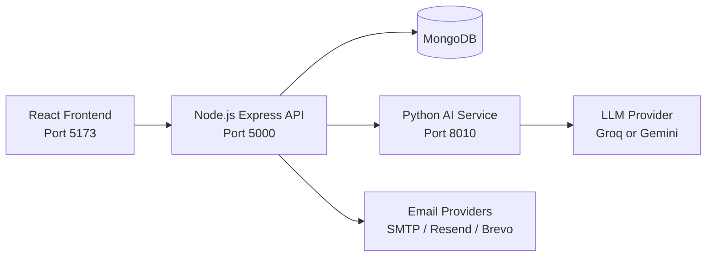
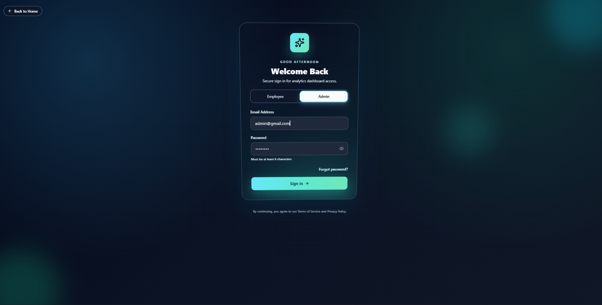
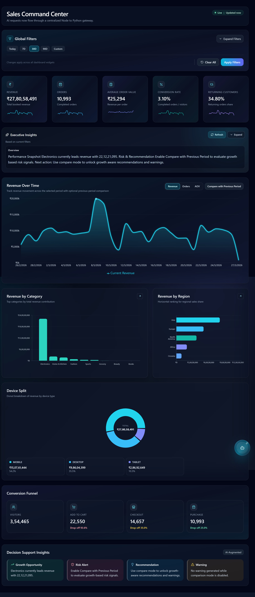
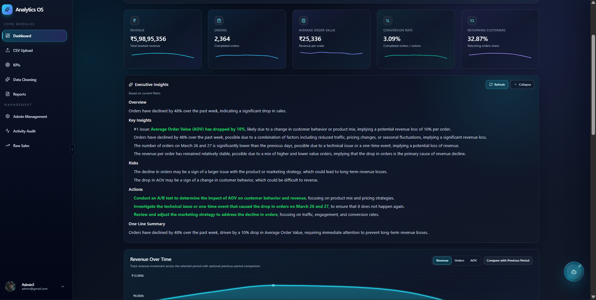
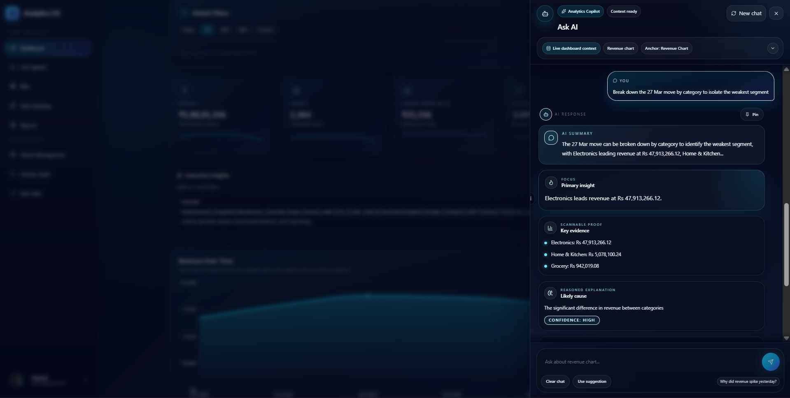

# AI Decision Support Analytics Dashboard

<p align="center">
  <a href="#"></a>
  <a href="#"></a>
  <a href="#"></a>
  <a href="#"></a>
  <a href="#"></a>
  <a href="#"></a>
</p>

<p align="center"><strong>Turn raw business data into clear, actionable decisions with AI-powered analytics.</strong></p>

---

## Overview

AI Decision Support Analytics Dashboard is a full-stack platform designed to help teams move from data collection to decision execution faster.

It combines interactive dashboards, AI-generated summaries, and a Copilot-style Ask AI assistant to interpret trends, anomalies, and business signals in plain language. The platform also includes production-ready essentials such as role-based access, OTP-based password recovery, report export, and modular API services.

This project is built to demonstrate practical engineering depth across frontend UX, backend architecture, data workflows, and AI integration.

---

## Features

- Interactive analytics dashboard for KPI tracking and trend visibility
- AI Summary module that converts metrics into executive-ready insights
- Ask AI assistant for conversational, context-aware business Q and A
- OTP-based forgot password flow with provider fallback support (SMTP/Resend/Brevo)
- Role-aware authentication and authorization
- CSV/API ingestion and preprocessing pipeline
- Data cleaning and duplicate handling workflows
- Report generation and export (PDF/Excel)
- Modular backend controllers/services for clean scalability
- Dedicated Python AI service for model-driven analysis
- Modern UI with React, Tailwind, and charting libraries

---

## Tech Stack

### Frontend

- React.js (Vite)
- Tailwind CSS
- Recharts / ECharts
- Axios

### Backend

- Node.js
- Express.js
- Mongoose
- JWT Authentication

### AI Services

- Python
- FastAPI
- Groq / Gemini provider hooks

### Database

- MongoDB

---

## System Architecture

The application is split into three core layers:

1. Frontend client (React + Tailwind) for data visualization and user interaction.
2. Backend API gateway (Node + Express) for auth, business logic, data orchestration, and report generation.
3. Python AI service (FastAPI) for Ask AI routing and analytical response generation.

### High-Level Flow



### Request Lifecycle (Example)

1. User asks a question in Ask AI.
2. Frontend sends the request to backend AI routes.
3. Backend forwards payload to Python AI service endpoint.
4. Python service routes analysis and calls configured LLM provider.
5. Response is returned to backend, then rendered in the frontend.

---

## Project Structure

```bash
ai-decision-support-analytics-dashboard/
  backend/              # Express API, auth, analytics, reports, data workflows
  frontend/             # React + Tailwind UI (dashboard, auth, Ask AI)
  python-ai-service/    # FastAPI AI gateway and inference routing
```

---

## Installation and Setup

### Prerequisites

- Node.js 18+
- Python 3.10+
- MongoDB (local or Atlas)
- npm

### 1. Clone Repository

```bash
git clone <your-repo-url>
cd ai-decision-support-analytics-dashboard
```

### 2. Setup Backend

```bash
cd backend
npm install
```

Create `.env` in `backend/` (see env template below), then run:

```bash
npm run dev
```

Backend runs on `http://localhost:5000`.

### 3. Setup Frontend

```bash
cd ../frontend
npm install
npm run dev
```

Frontend runs on `http://localhost:5173`.

### 4. Setup Python AI Service

```bash
cd ../python-ai-service
python -m venv venv
```

Activate environment:

Windows PowerShell:

```powershell
venv\Scripts\Activate
```

macOS/Linux:

```bash
source venv/bin/activate
```

Install and run:

```bash
pip install -r requirements.txt
uvicorn main:app --reload --host 0.0.0.0 --port 8010
```

Python AI service runs on `http://127.0.0.1:8010`.

---

## Environment Variables

### Backend (`backend/.env`)

```env
# Core
PORT=5000
MONGO_URI=mongodb://127.0.0.1:27017/ai_dashboard
JWT_SECRET=replace_with_strong_secret

# AI providers (backend AI service)
GEMINI_API_KEY=
GEMINI_MODEL=gemini-1.5-flash
GROQ_API_KEY=
GROQ_MODEL=llama-3.3-70b-versatile

# Ask AI Python service URL
ASK_AGENT_URL=http://127.0.0.1:8010/analyze

# OTP + forgot password
PASSWORD_RESET_OTP_TTL_MINUTES=10
PASSWORD_RESET_OTP_RESEND_COOLDOWN_SECONDS=60
OTP_EMAIL_PROVIDER=auto
OTP_EMAIL_MAX_RETRIES=2

# SMTP (option 1)
SMTP_HOST=
SMTP_PORT=587
SMTP_SECURE=false
SMTP_USER=
SMTP_PASS=
SMTP_FROM=
SMTP_SKIP_VERIFY=false

# Resend (option 2)
RESEND_API_KEY=
RESEND_FROM=

# Brevo (option 3)
BREVO_API_KEY=
BREVO_FROM=
```

### Python AI Service (`python-ai-service/.env`)

```env
# Provider credentials
GROQ_API_KEY=

# Mongo settings
MONGODB_URI=mongodb://localhost:27017
MONGODB_DB=analytics

# AI routing/model config
COPILOT_LLM_PROVIDER=groq
COPILOT_ROUTER_PROVIDER=
COPILOT_ANSWER_PROVIDER=
GROQ_MODEL=llama-3.3-70b-versatile
COPILOT_ROUTER_MODEL=
COPILOT_ANSWER_MODEL=

# Runtime and limits
GROQ_TIMEOUT_SECONDS=30
MAX_RESULT_LIMIT=50
COPILOT_HISTORY_TURN_LIMIT=10
COPILOT_SERIES_LIMIT=60
COPILOT_GROUP_LIMIT=20
ALLOW_NON_VENV_PYTHON=false
```

### Frontend

No required `.env` keys for local development by default. The dev server proxies `/api` to `http://localhost:5000` via Vite config, while several modules also use explicit localhost URLs.

---

## Usage

1. Start MongoDB.
2. Start backend server on port `5000`.
3. Start Python AI service on port `8010`.
4. Start frontend on port `5173`.
5. Open `http://localhost:5173`.

### Typical User Flow

- Sign in and access role-based dashboard modules
- Upload or fetch data (CSV/API)
- Explore visual analytics and KPI trends
- Generate AI Summary for executive-level interpretation
- Ask AI follow-up business questions
- Export reports as PDF/Excel

---

## Screenshots






### Suggested Screenshots to Capture

- Main dashboard with charts and KPI cards visible
- AI Summary response panel showing generated insights
- Ask AI chat panel with one query and response
- Login + forgot password + OTP verification flow
- Admin/User management page (role control)
- Report export screen (PDF/Excel actions)
- Data preprocessing/cleaning screen with before and after view

Tip: Capture both desktop and mobile responsive views to showcase UI quality.

---

## Future Improvements

- Add Docker and docker-compose for one-command local startup
- Introduce CI/CD pipeline (lint, test, build, deploy)
- Add automated API documentation (OpenAPI + Swagger UI)
- Improve frontend API configuration through env-driven base URLs
- Add advanced forecasting and anomaly detection models
- Implement WebSocket-based real-time analytics updates
- Add enterprise audit trails and granular permission controls

---

## Recruiter Notes

This project demonstrates:

- Full-stack architecture design across JavaScript and Python
- AI feature integration into real product workflows
- Secure auth flows (JWT + OTP reset)
- Data engineering workflows (ingestion, cleaning, transformation)
- Production-minded modular API design

---

## Author

**Yuvraj**  
Senior Software Engineer | Full-Stack Developer | AI Product Builder

GitHub: add your profile link here

---

## License

Licensed under the ISC License.

If you are using this project for learning or portfolio purposes, attribution is appreciated.
