# Full System DFD (Mermaid)

This document models the full platform data flow for:

- Frontend (React dashboard)
- Backend (Node/Express API)
- Python AI service (`python-ai-service`)
- External providers and data sources
- Data stores (MongoDB and upload storage)

## Level 0 DFD (System Context)

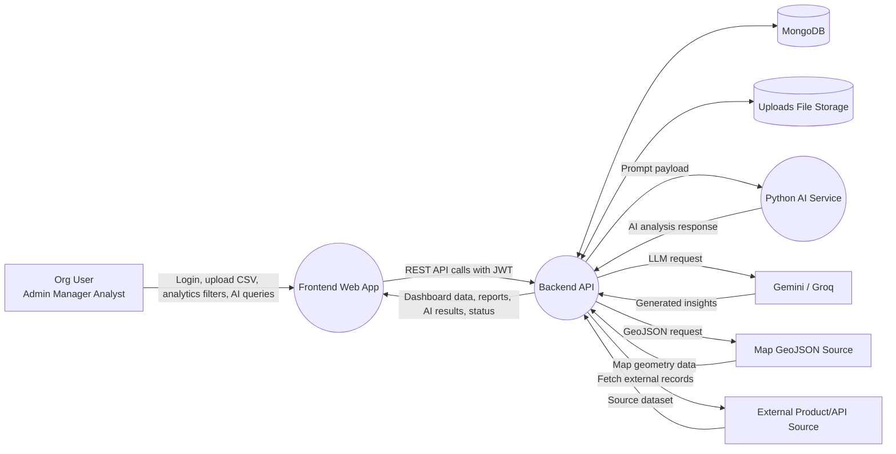

## Level 1 DFD (Major Processes)

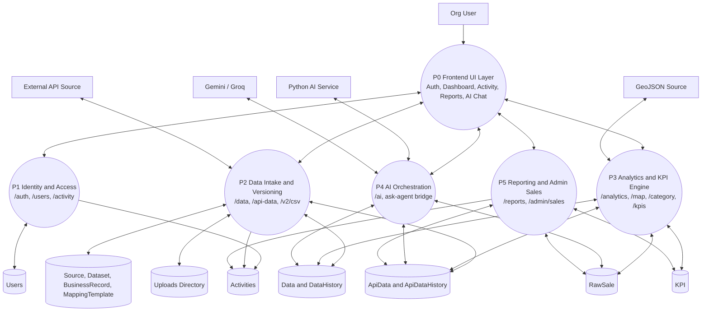

## Level 2 DFD (Detailed End-to-End)

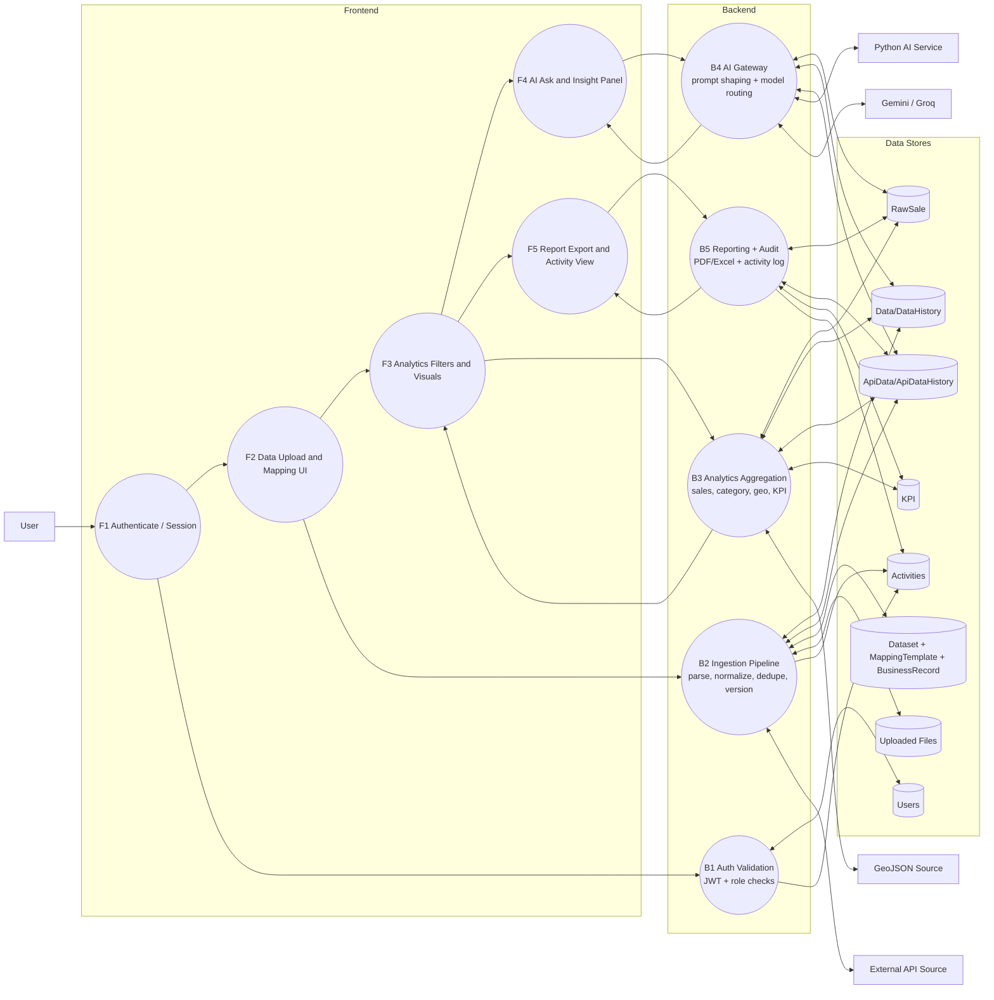

## Export Tips

- Preview this file in VS Code Markdown preview.
- If Mermaid is enabled, copy each diagram block to Mermaid Live Editor for PNG/SVG export.
- For formal docs, keep Level 0 for overview, Level 1 for module discussion, and Level 2 for implementation walkthroughs.

## Auth and Password Reset Flow (Project-Specific)

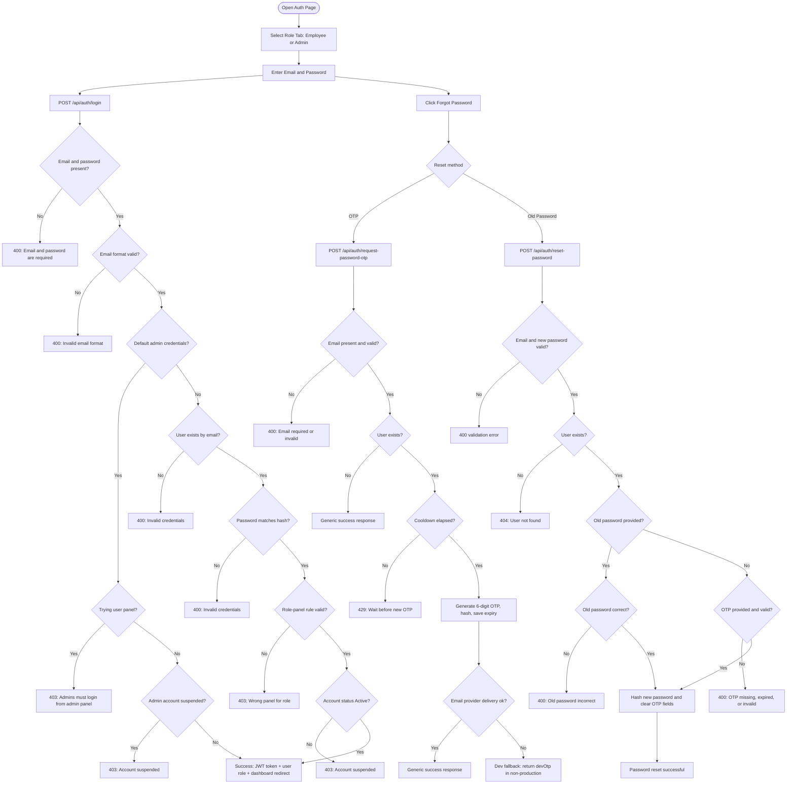

## Registration Flow (Project-Specific)

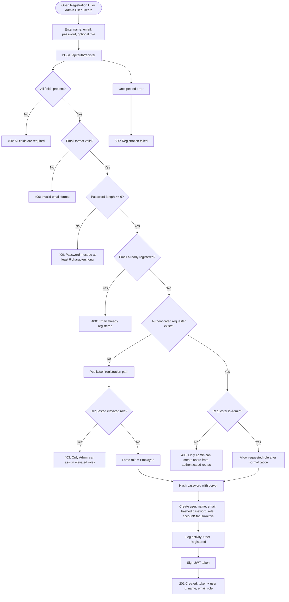

## Forgot Password Flow (Project-Specific)

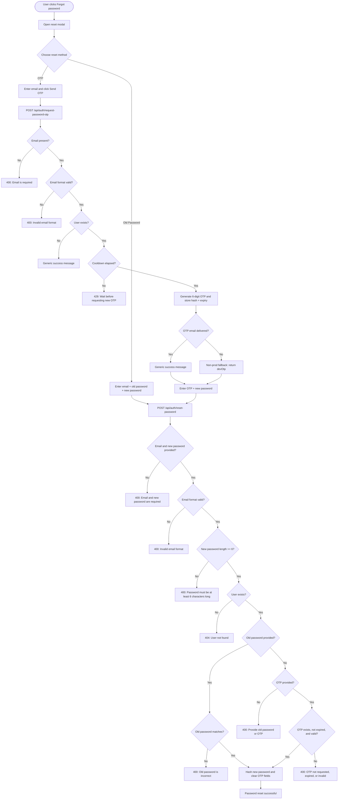

## Unified Auth Lifecycle (Compact Thesis View)

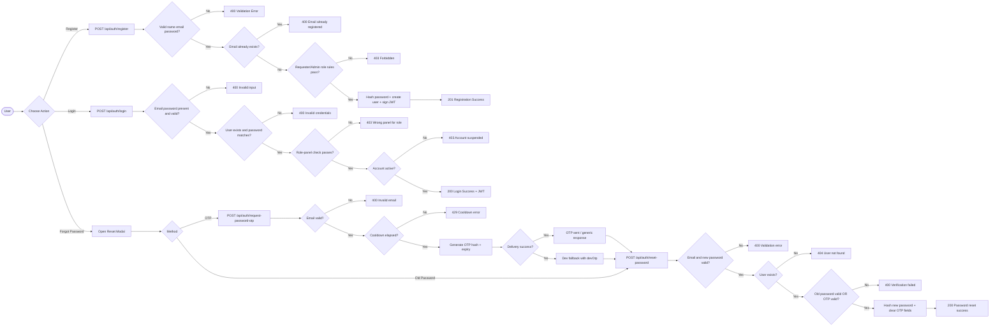

## Data Ingestion Pipeline Flow (Domain-Specific)

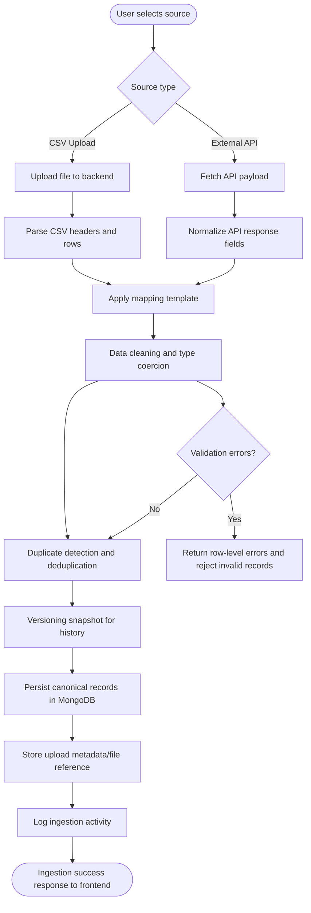

## Analytics and KPI Processing Flow (Domain-Specific)

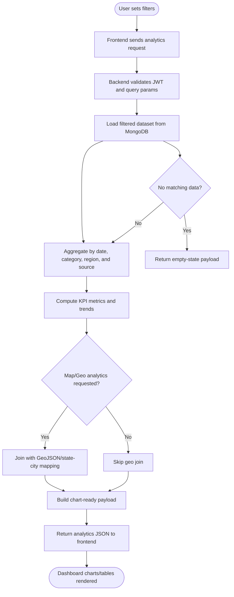

## AI Orchestration Flow (Domain-Specific)

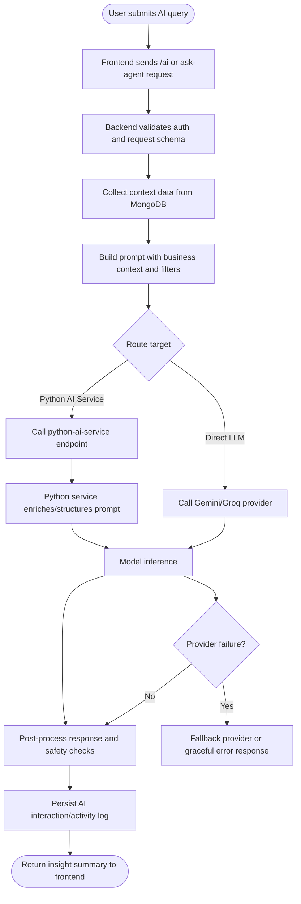

## Reporting and Export Flow (Domain-Specific)

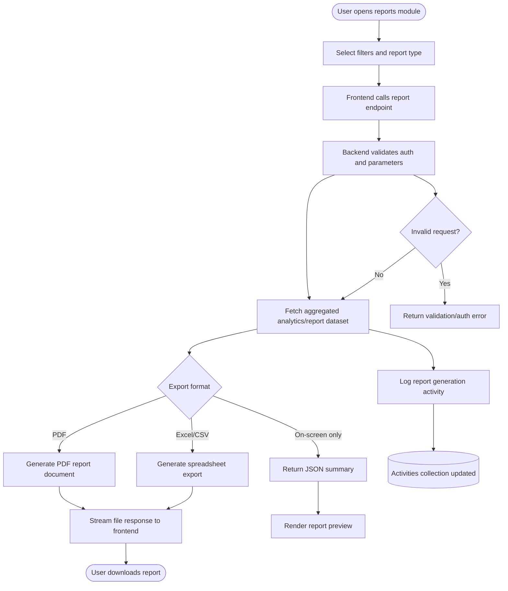
