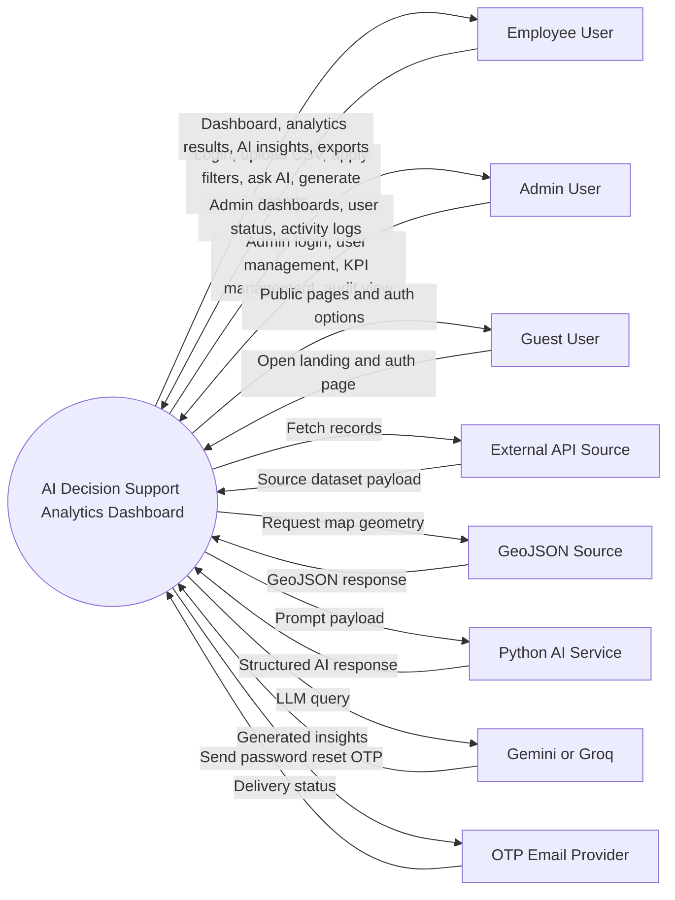
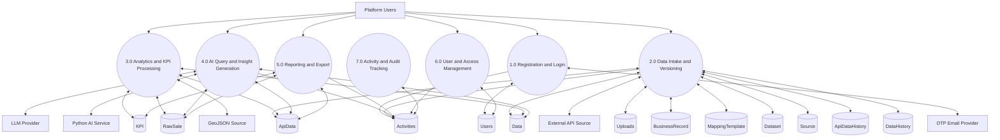
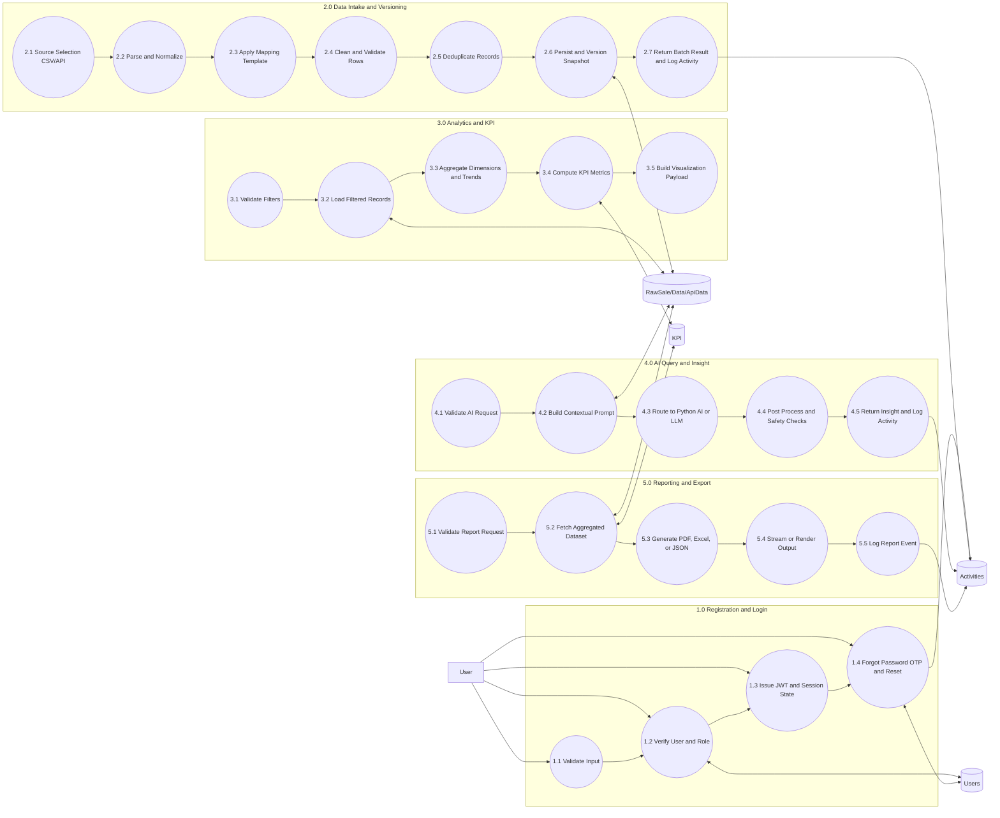

# Thesis DFD Diagrams (Mermaid)

This file provides clean, submission-ready DFD diagrams for:
- Context Level DFD
- Level 1 DFD
- Level 2 DFD (core decomposition)

## 1) Context Level DFD

## 2) Level 1 DFD

## 3) Level 2 DFD (Core Decomposition)

## Export Steps

1. Open this file in Markdown preview.
2. Copy each Mermaid block into Mermaid Live Editor for PNG or SVG.
3. Use Context + Level 1 in the main thesis chapter.
4. Put Level 2 in implementation or appendix section.
